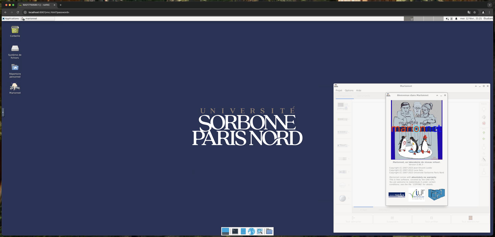

# marionnet-dockerized 🐳

Exécutez **[Marionnet](https://marionnet.org/)** dans un conteneur Docker et accédez-y via votre navigateur grâce à **NoVNC** ! 🚀



---

## Sommaire

- [Démarrage rapide](#démarrage-rapide)
- [Utilisation](#utilisation)
- [Instructions de développement](#instructions-de-développement)
- [Tableau des compatibilités](#tableau-des-compatibilités)
- [Dépannage](#dépannage)
- [Contribution](#contribution)
- [Remerciements](#remercimements)
- [Licence](#licence)

---

## Démarrage rapide

Pour lancer Marionnet en quelques secondes, exécutez la commande suivante :

```bash
docker run -d -p 6901:6901 ghcr.io/michelbaie/marionnet-dockerized
```

Vous pouvez également utiliser [**Docker Compose**](https://docs.docker.com/compose/) :

```yaml
version: '3'
services:
  marionnet:
    image: ghcr.io/michelbaie/marionnet-dockerized
    ports:
      - "6901:6901"
    hostname: marionnet
```

Ensuite, démarrez votre service :

```bash
docker compose up -d
```

---

## Utilisation

Une fois le conteneur lancé, vous pouvez accéder à l’interface web de Marionnet via votre navigateur à l’adresse suivante :

- **Version complète** : [http://IP:6901/vnc.html?password=](http://IP:6901/vnc.html?password=)
- **Version allégée** : [http://IP:6901/vnc_lite.html?password=](http://IP:6901/vnc_lite.html?password=)

> **Astuce :** Vous pouvez également vous connecter avec un client VNC en utilisant le port **5901**

---

## Instructions de développement

Pour personnaliser ou contribuer au projet, suivez ces étapes :

1. **Construire l’image**
   Utilisez le Dockerfile pour construire l’image personnalisée

2. **Lancer l’image et installer Marionnet**
   Exécutez le conteneur, puis lancez le script d’installation disponible sur [Launchpad](https://bazaar.launchpad.net/~marionnet-drivers/marionnet/trunk/view/head:/useful-scripts/marionnet_from_scratch)

3. **Installer Konsole**
   Installez Konsole via APT et modifiez le fichier `/etc/marionnet/marionnet.conf` pour définir **konsole** comme invite de commande par défaut

4. **Personnaliser l’interface**
   Utilisez l’utilitaire `alacarte` pour modifier l’agencement des icônes dans le lanceur d’applications

5. **Définir le fond d’écran**
   Configurez le fond d’écran avec le wallpaper de l’Université Sorbonne Paris Nord (ex-Paris 13)

6. **Valider vos modifications**
   Arrêtez le conteneur et committez les modifications à l’image principale

> **Note :** Cette implémentation n’est pas optimale, car le script d’installation de Marionnet ne permet pas de fonctionner en mode non interactif. N’hésitez pas à proposer des améliorations ! 🔧

---

## Tableau des compatibilités

Marionnet dans Docker fonctionne comme des **poupées russes** : certains environnements peuvent présenter des limitations.

| Système d'exploitation                      | Niveau de compatibilité           |
| ------------------------------------------- | --------------------------------- |
| **Windows**                                 | ✅ Fonctionne avec WSL2 et Hyper-V |
| **Linux**                                   | ✅ Fonctionne                      |
| **macOS sans Rosetta (Puce Intel)**         | ✅ Fonctionne                      |
| **macOS avec Rosetta (Puce Apple Silicon)** | ❌ Ne fonctionne pas               |

---

## Dépannage

- **Problème lié aux namespaces :** 
  Certains problèmes liés aux namespaces peuvent survenir en raison de la complexité de la conteneurisation.
  Pour tenter de résoudre ces erreurs, exécutez le conteneur en mode **privileged** :

  ```bash
  docker run --privileged -d -p 6901:6901 ghcr.io/michelbaie/marionnet-dockerized
  ```

- **En cas de soucis de compatibilité :** 
  Il est recommandé d’utiliser la version Docker de Marionnet sous **Windows** ou **Linux**, ou d’opter pour une machine virtuelle native.

---

## Contribution

Les contributions sont les bienvenues ! 🤝 
Si vous souhaitez améliorer ce projet ou proposer des modifications, n’hésitez pas à créer une **issue** ou à soumettre une **pull request**.

---

## Remerciements 🙏

Je tiens à remercier chaleureusement plusieurs projets et leurs développeurs qui ont grandement contribué à la réalisation de cette image Docker :

- **[accetto/debian-vnc-xfce-g3](https://github.com/accetto/debian-vnc-xfce-g3/)**
  Un immense merci pour votre travail exceptionnel sur l'image Docker. Votre code a servi de base pour ce projet et a permis de créer un environnement fiable et convivial. 🚀

- **Les développeurs de Marionnet et Mariotel**
  Merci aux équipes derrière **Marionnet** et **Mariotel**. J'ai réutilisé des bouts de code issus de ces projets pour mener à bien cette image Docker. Pour en savoir plus sur Marionnet, consultez leurs ressources :  
  - [Marionnet - Site officiel](https://www.marionnet.org/site/index.php/fr/)  
  - [Informations sur Marionnet](https://tel.marionnet.org/info.php)
  Votre travail pionnier dans la virtualisation de réseaux a inspiré ce projet et continue d'enrichir l'écosystème open-source. 💡

Merci à tous pour votre engagement et votre passion pour le développement open-source ! 🎉

## Licence

Ce projet est sous licence [MIT](LICENSE).
Consultez le fichier `LICENSE` pour plus d’informations.